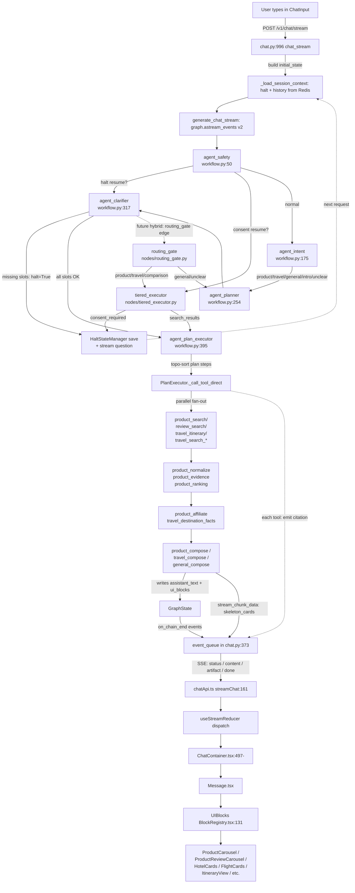

# Architecture

**Analysis Date:** 2026-04-16
**Branch:** v2-with-swipe (deployed as production main)

## Pattern Overview

**Overall:** Multi-agent AI pipeline with event-driven SSE streaming and editorial-luxury frontend.

**Key Characteristics:**
- LangGraph state machine orchestrates 5 sequential agents (`safety → intent → planner → clarifier → plan_executor`) plus 2 alternate-path nodes (`routing_gate → tiered_executor`) sharing one `GraphState` blackboard.
- Tools are defined as Model Context Protocol (MCP) tools in `backend/mcp_server/tools/` but executed **in-process** via `PlanExecutor._call_tool_direct()` — the MCP stdio server (`backend/mcp_server/main.py`) exists for external clients but is NOT used at runtime.
- Two-track execution: **LLM-driven** (Planner Agent → PlanExecutor) for general/unclear/intro intents, OR **deterministic** (TieredAPIOrchestrator) for product/comparison/price_check/travel/review_deep_dive intents (`backend/app/services/langgraph/nodes/routing_gate.py:7-13`).
- Frontend consumes a single named-event SSE stream (`/v1/chat/stream`) and renders typed `ui_blocks` through a registry pattern (`frontend/components/blocks/BlockRegistry.tsx`).
- Multi-turn conversations managed through Redis halt-state persistence (`backend/app/services/halt_state_manager.py`).
- Editorial-luxury frontend: warm ivory (`#FAFAF7`) / deep ink (`#1C1917`) palette, Instrument Serif headings + DM Sans body, semantic CSS variables in `frontend/app/globals.css:5-100`.

## Layers

**Presentation (Frontend):**
- Purpose: Chat UI, browse/discover/results pages, admin panel
- Location: `frontend/app/`, `frontend/components/`
- Contains: Next.js 14 App Router pages, React client components, SSE stream consumer
- Depends on: Backend REST/SSE API at `NEXT_PUBLIC_API_URL`
- Used by: End users via browser

**API Gateway:**
- Purpose: FastAPI HTTP layer, CORS, rate limiting, JWT auth
- Location: `backend/app/api/v1/`
- Contains: `chat.py`, `health.py`, `admin.py`, `affiliate.py`, `telemetry.py`, `qos.py`, `core_config.py`
- Depends on: LangGraph workflow, repositories, Redis
- Used by: Frontend, external callers

**Agent Orchestration:**
- Purpose: LangGraph state machine coordinating 5 agents plus 2 tiered-routing nodes
- Location: `backend/app/services/langgraph/workflow.py`
- Contains: Node wrapper functions, conditional edge routing, graph compilation; `nodes/routing_gate.py`, `nodes/tiered_executor.py`
- Depends on: Agent classes, PlanExecutor, HaltStateManager, run_stage_with_budget
- Used by: `chat.py` API route via `graph.astream_events(initial_state, version="v2", ...)` (`backend/app/api/v1/chat.py:381`)

**Agents:**
- Purpose: Specialized LLM-driven reasoning units with single responsibilities
- Location: `backend/app/agents/`
- Contains: `safety_agent.py`, `intent_agent.py`, `planner_agent.py`, `clarifier_agent.py`, `query_complexity.py`
- Depends on: `BaseAgent` (`base_agent.py`), `model_service`, OpenAI API
- Used by: LangGraph node wrappers

**MCP Tools / Plan Executor:**
- Purpose: Domain tool functions that read/write `GraphState` fields; called in-process by `PlanExecutor`
- Location: `backend/mcp_server/tools/` (22 tool files), `backend/app/services/plan_executor.py`
- Tool registry: dynamically loaded at `plan_executor.py:38-69` via `_load_tool_registry()` from `tool_contracts.py`
- Depends on: search providers, affiliate providers, travel providers, `model_service`
- Used by: `plan_executor_node` in `workflow.py:395-475`

**Tiered Router:**
- Purpose: Deterministic cost-tiered API routing as alternative path for product/travel intents
- Location: `backend/app/services/tiered_router/`
- Contains: `router.py` (`TIER_ROUTING_TABLE` dict at line 15-63), `orchestrator.py` (`TieredAPIOrchestrator`), `parallel_fetcher.py`, `circuit_breaker.py`, `data_validator.py`, `api_registry.py`, `api_logger.py`
- Depends on: External APIs (Amazon, eBay, Walmart, BestBuy, Amadeus, etc.)
- Used by: `tiered_executor_node` and `routing_gate_node`

**Services:**
- Purpose: Cross-cutting infra — state persistence, search, affiliate, travel, sessions
- Location: `backend/app/services/`
- Contains: `halt_state_manager.py`, `chat_history_manager.py`, `search/`, `affiliate/`, `travel/`, `serpapi/`, `model_service.py`, `session_service.py`, `preference_service.py`, `link_health_checker.py`, `tool_validator.py`, `stage_telemetry.py`
- Depends on: Redis, PostgreSQL, external provider APIs
- Used by: Agents, tools, API routes

**Repositories / Data:**
- Purpose: Async SQLAlchemy data access
- Location: `backend/app/repositories/`, `backend/app/models/`
- Contains: ORM models for `users`, `sessions`, `conversation_messages`, `affiliate_links`, `affiliate_clicks`, `affiliate_merchants`, `airport_cache`, `api_usage_logs`, `request_metrics`, `product_index`
- Depends on: PostgreSQL via `AsyncSession`
- Used by: API routes and services

**Core:**
- Purpose: Shared infra — config, DB, Redis, logging, rate limiting
- Location: `backend/app/core/`
- Contains: `config.py` (pydantic-settings), `database.py`, `redis_client.py`, `centralized_logger.py`, `colored_logging.py`, `rate_limiter.py`, `dependencies.py`, `error_manager.py`
- Depends on: Environment variables, PostgreSQL, Redis
- Used by: All other backend layers

## Data Flow

### Mermaid Diagram — End-to-End Request



### Normal Chat Request (LLM Path)

1. User sends `POST /v1/chat/stream` with `{message, session_id?, user_id?, country_code?, action?}` from `frontend/lib/chatApi.ts:208`.
2. `chat.py:996 chat_stream` resolves session ownership (`backend/app/api/v1/chat.py:1023-1044`), loads/creates session, extracts `X-Interaction-ID`.
3. `generate_chat_stream` (`chat.py:176`) emits initial `status` SSE event `{"text":"Thinking...","placeholder":true}` (line 219), then `_load_session_context` concurrently fetches halt state + conversation history from Redis (`chat.py:30-36`).
4. Builds `initial_state: GraphState` (`chat.py:295-353`), spawning 47 named fields including `slots`, `intent`, `plan`, `affiliate_products`, `hotels`, `flights`, `cars`, `itinerary`, `stream_chunk_data`, `stage_telemetry`.
5. `consume_events()` (`chat.py:377`) iterates `graph.astream_events(initial_state, version="v2", config={"callbacks": [langfuse_handler]})` and pushes events into an `asyncio.Queue`.
6. `_drain_event_loop()` (`chat.py:400`) pulls events with `CHAT_EVENT_QUEUE_TIMEOUT`, enforces `MAX_TOTAL_REQUEST_S` (60 s) hard cap.
7. **LangGraph node sequence** (each wrapped in `run_stage_with_budget` from `stage_telemetry.py`):
   - `safety_node` (`workflow.py:50`) — checks Redis halt state first; on resume, restores `intent/slots/plan` and routes directly to `clarifier`. Otherwise: OpenAI moderation, PII redaction, appends user message to `conversation_history`. Fallback on timeout: `policy_status="unchecked"`, proceed to intent.
   - `intent_node` (`workflow.py:175`) — classifies into one of `product / travel / service / general / comparison / intro / unclear`. Has 5-min in-memory cache (`intent_agent.py:18`). May write `intro_text` for first-time greetings. Fallback: `intent="general"`.
   - `planner_node` (`workflow.py:254`) — selects entry-point tools via GPT (`PLANNER_SYSTEM_PROMPT` at `planner_agent.py:42`); auto-expands via pre/post deps and `is_default=True` tools (`tool_contracts.py:181-267`). Fallback: single-step `{intent}_compose` template plan.
   - `clarifier_node` (`workflow.py:317`) — validates slots vs `required_slots` from tool contracts. If missing slots: sets `halt=True`, writes question to `assistant_text`, status `halted`. Otherwise: routes to `plan_executor`.
   - `plan_executor_node` (`workflow.py:395`) — instantiates a fresh `PlanExecutor()` per request (line 412, prevents cross-session leaks), topologically sorts plan steps, runs parallel fan-out within steps with `_TOOL_TIMEOUT_S=30s` per tool, `_STEP_TIMEOUT_S=45s` per step (`plan_executor.py:28-36`).
8. Each tool emits a citation message via `_emit_tool_citation` (`plan_executor.py:365`) → writes to `state["stream_chunk_data"]={"type":"tool_citation","data":{...}}`. LangGraph's `on_chain_end` event picks this up and the `chat.py:455-479` block converts it to an SSE `status` event so the frontend shows "Comparing prices across retailers...", etc.
9. Compose tools (`product_compose`, `travel_compose`, `general_compose`) write `assistant_text` and `ui_blocks` to state. `product_compose.py:465` also emits early `skeleton_cards` via `stream_chunk_data` so the user sees product names while affiliate links resolve.
10. After the LangGraph terminal `on_chain_end` event for `LangGraph` (`chat.py:450`), `result_state` contains the full final state. The endpoint:
    - Sends `artifact` event with `ui_blocks + clear:true` for product intent in one chunk (`chat.py:594`)
    - Streams `assistant_text` via `content` events in 24-char chunks with 20 ms delay (`chat.py:614`)
    - Builds `ResponseMetadata` (RFC §2.5 — provider coverage, confidence score, missing sources) at `chat.py:636-707`
    - Sends terminal `done` event (`chat.py:709-727`) with `ui_blocks`, `citations`, `followups`, `next_suggestions`, `request_id`, `stage_telemetry`
    - Fire-and-forget: writes `RequestMetric` row + persists chat turn via `chat_history_manager.save_turn` (`chat.py:735-784`)
11. Frontend `streamChat` (`frontend/lib/chatApi.ts:161`) parses SSE wire format (`event: <type>\ndata: <json>\n\n`), routes by event type at `chatApi.ts:295-371`:
    - `status` → `onToken(text, isPlaceholder=true)` → status pill
    - `content` → `onToken(token, false)` → typing animation
    - `artifact` → `onClear()` if `clear`, then `onComplete({ui_blocks, itinerary, create_new_message})`
    - `done` → final `onComplete` with full metadata, fires `sendTelemetry(milestones)` for p95 TTFC tracking
    - `error` → `onError(message)`
12. `ChatContainer.handleStream` (`frontend/components/ChatContainer.tsx:344`) dispatches to `useStreamReducer` (`frontend/hooks/useStreamReducer.ts:59`) FSM (`idle → placeholder → receiving_status → receiving_content → finalized`) and updates the message list.
13. `Message.tsx` renders `ui_blocks` through `UIBlocks` (`frontend/components/blocks/BlockRegistry.tsx:131`) which dispatches to typed renderers in `BLOCK_RENDERERS` dict (line 34-123) and groups multiple `product_review` blocks into a `ProductReviewCarousel` (line 174-189).

### Product Query — File Trace

User query: "best wireless earbuds under $200"

| Step | File | Function |
|------|------|----------|
| 1 | `frontend/components/ChatInput.tsx` | submit → `frontend/lib/chatApi.ts:streamChat` |
| 2 | `backend/app/api/v1/chat.py:996` | `chat_stream` route handler |
| 3 | `backend/app/api/v1/chat.py:176` | `generate_chat_stream` builds `initial_state` |
| 4 | `backend/app/services/langgraph/workflow.py:50` | `safety_node` → Moderation API + PII check |
| 5 | `backend/app/services/langgraph/workflow.py:175` | `intent_node` → returns `intent="product"` |
| 6 | `backend/app/services/langgraph/workflow.py:254` | `planner_node` → LLM picks `["product_search"]` |
| 7 | `backend/mcp_server/tool_contracts.py:181` | `get_required_tools_from_dependencies` expands to `[product_search, review_search, product_evidence, product_normalize, product_affiliate, product_ranking, product_compose, next_step_suggestion]` |
| 8 | `backend/app/services/langgraph/workflow.py:317` | `clarifier_node` — `product_search` has no `required_slots`, proceeds |
| 9 | `backend/app/services/plan_executor.py:156` | `PlanExecutor.execute` topo-sorts and runs steps |
| 10 | `backend/mcp_server/tools/product_search.py` | OpenAI generates list of real product names → writes `product_names` |
| 11 | `backend/mcp_server/tools/review_search.py` | SerpAPI search Wirecutter/Reddit/RTINGS → writes `review_data` |
| 12 | `backend/mcp_server/tools/product_evidence.py` | Analyzes reviews → writes `review_aspects` |
| 13 | `backend/mcp_server/tools/product_normalize.py` | Merges into `normalized_products` |
| 14 | `backend/mcp_server/tools/product_affiliate.py` | Looks up Amazon/eBay/Walmart links → writes `affiliate_products` |
| 15 | `backend/mcp_server/tools/product_ranking.py` | Scores → writes `ranked_products` |
| 16 | `backend/mcp_server/tools/product_compose.py:465` | Emits `skeleton_cards` via `stream_chunk_data`, then writes `assistant_text + ui_blocks` |
| 17 | `backend/mcp_server/tools/next_step_suggestion.py` | Generates 3-5 follow-up questions → writes `next_suggestions` |
| 18 | `backend/app/api/v1/chat.py:594` | Streams `artifact` event with `ui_blocks` |
| 19 | `frontend/lib/chatApi.ts:321` | `artifact` handler → `onComplete({ui_blocks})` |
| 20 | `frontend/components/blocks/BlockRegistry.tsx:38-57` | `products` renderer → `<ProductCarousel>` |

### Travel Query — File Trace (Phase 24 fan-out)

User query: "5-day trip to Tokyo from NYC for 2 adults"

| Step | File | Function |
|------|------|----------|
| 1-6 | (same as product flow) | safety → intent (`intent="travel"`) → planner |
| 7 | `backend/app/agents/planner_agent.py` | LLM picks `["travel_itinerary"]`; auto-expands via post deps to `[travel_itinerary, travel_search_hotels, travel_search_flights, travel_search_cars, travel_compose, next_step_suggestion]` (see `travel_itinerary.py` TOOL_CONTRACT post deps) |
| 8 | `backend/app/services/langgraph/workflow.py:317` | `clarifier_node` — required slots `[destination, duration_days]` for itinerary; `[origin, destination, departure_date, duration_days, adults]` for flights. If `origin` missing, halts with question. |
| 9 | `backend/app/services/plan_executor.py:_execute_step` | Step with `parallel: true` runs `travel_search_hotels`, `travel_search_flights`, `travel_search_cars` concurrently via `asyncio.gather` (`plan_executor.py:283-310`) |
| 10 | `backend/mcp_server/tools/travel_itinerary.py` | LLM generates day-by-day plan → writes `itinerary` |
| 11 | `backend/mcp_server/tools/travel_search_hotels.py` | Returns Booking.com/Expedia hotel PLP search links → writes `hotels` |
| 12 | `backend/mcp_server/tools/travel_search_flights.py` | Generates Expedia flight PLP link → writes `flights` |
| 13 | `backend/mcp_server/tools/travel_search_cars.py` | Generates Expedia car rental PLP link → writes `cars` |
| 14 | `backend/mcp_server/tools/travel_compose.py` | Composes final response → writes `assistant_text + ui_blocks` |
| 15 | `frontend/components/blocks/BlockRegistry.tsx:147-172` | `UIBlocks` dispatcher detects both `hotels` AND `flights` → renders side-by-side `md:grid-cols-2` grid; `itinerary` → `<ItineraryView>` |

### Halt / Resume Flow (Multi-turn)

1. Clarifier or executor sets `halt=True`, `followups=[{slot, question}, ...]` in state (`workflow.py:340-344`).
2. `chat.py:625` detects halt, sends `done` SSE with `followups` payload, closes stream.
3. Halt state persisted to Redis under key `halt_state:{session_id}` via `HaltStateManager.save_halt_state` (`backend/app/services/halt_state_manager.py:17-46`) with TTL `HALT_STATE_TTL`. Cached at process level in `_cache: Dict[str, Optional[Dict[str, Any]]]` (line 40).
4. User answers; next request arrives with same `session_id`.
5. `safety_node` calls `HaltStateManager.check_halt_exists` and `load_halt_state` (`workflow.py:67-105`); if followups exist, restores `intent + slots + plan` and sets `next_agent="clarifier"` — bypasses intent and planner.

### Tiered API Routing Path

1. `routing_gate_node` (`backend/app/services/langgraph/nodes/routing_gate.py:16`) inspects `state["intent"]`. If in `DETERMINISTIC_INTENTS = {product, comparison, price_check, travel, review_deep_dive}`, sets `next_agent="tiered_executor"`. Otherwise `"planner"`.
2. `tiered_executor_node` (`backend/app/services/langgraph/nodes/tiered_executor.py:12`) calls `TieredAPIOrchestrator.execute(intent, query, state)` (`backend/app/services/tiered_router/orchestrator.py:33`).
3. `TieredAPIOrchestrator` walks tiers 1→4 from `TIER_ROUTING_TABLE` (`router.py:15-63`):
   - **Tier 1 (product):** `amazon_affiliate, walmart_affiliate, bestbuy_affiliate, ebay_affiliate, google_cse_product`
   - **Tier 2:** `bing_search, youtube_transcripts`
   - **Tier 3:** `reddit_api`
   - **Tier 4:** `serpapi`
   - **Tier 1 (travel):** `amadeus, booking, expedia, google_cse_travel`
4. `ParallelFetcher.fetch_tier` (`parallel_fetcher.py:27`) fans out via `asyncio.gather`, filters circuit-broken APIs.
5. `DataValidator.validate` (`data_validator.py`) decides: success / partial / escalate / consent_required.
6. Tier 3-4 escalation requires user consent → halt with `halt_reason="consent_required"`, save `partial_items` to Redis. On resume, `safety_node` routes to `tiered_executor` (workflow.py:522).
7. On success, returns `search_results, snippets, sources_used` and routes to `agent_plan_executor` for synthesis (workflow.py:571).

**NOTE:** As of 2026-04-16, the `agent_clarifier` → `routing_gate` edge is registered in `workflow.py:550` but the clarifier node itself sets `next_agent="plan_executor"` (`workflow.py:346,350`), so the tiered path is currently dormant in the LLM flow and only fires when the routing gate is reached via consent-resume. Full hybrid routing requires the clarifier to emit `next_agent="routing_gate"` when intent is in `DETERMINISTIC_INTENTS`.

### Streaming Pipeline

```
Tool emits stream_chunk_data            ChatContainer onEvent dispatch
   ↓                                       ↑
plan_executor.py:380                    chatApi.ts onEvent (line 290)
   ↓                                       ↑
LangGraph on_chain_end event            SSE wire: event:status\ndata:{...}
   ↓                                       ↑
chat.py:455 _drain_event_loop  ─yield→  StreamingResponse SSE
   ↓
_sse_event(type, data)  →  "event: artifact\ndata: {...}\n\n"
```

Key streaming primitives:
- `state["stream_chunk_data"]` is a transient field — tools write `{"type": "tool_citation"|"skeleton_cards"|"itinerary", "data": {...}}` and LangGraph's `on_chain_end` picks it up so `chat.py:466,469` can convert to `status` or `artifact` SSE events.
- 60-second hard cap on entire SSE connection (`chat.py:407`, `MAX_TOTAL_REQUEST_S` from `stage_telemetry.py`).
- Per-stage telemetry recorded via `run_stage_with_budget` and accumulated into `state["stage_telemetry"]` (annotated with `operator.add`).

## Key Abstractions

**GraphState (TypedDict):**
- Purpose: Shared blackboard for the entire agent pipeline
- Location: `backend/app/schemas/graph_state.py:11-109`
- Pattern: TypedDict (NOT Pydantic — for LangGraph compatibility) with `Annotated[List, operator.add]` accumulator fields
- Accumulator fields (concatenate, don't overwrite): `conversation_history`, `evidence_citations`, `citations`, `agent_statuses`, `tool_citations`, `errors`, `stage_telemetry`
- Key fields: `user_message`, `session_id`, `slots`, `followups`, `intent`, `policy_status`, `plan`, `search_results`, `product_names`, `review_data`, `normalized_products`, `affiliate_products`, `comparison_table`, `travel_info`, `hotels`, `flights`, `cars`, `itinerary`, `stream_chunk_data`, `assistant_text`, `ui_blocks`, `next_suggestions`

**BaseAgent:**
- Purpose: Abstract base providing LLM generation, error handling, logging
- Location: `backend/app/agents/base_agent.py`
- Pattern: Abstract `run()` method; `generate()` delegates to `model_service`
- Subclasses: `SafetyAgent`, `IntentAgent`, `PlannerAgent`, `ClarifierAgent`

**MCP Tool Pattern:**
- Purpose: Stateless functions that take full `GraphState` dict and return partial state patch
- Location: `backend/mcp_server/tools/*.py`
- Pattern: `async def tool_name(state: dict) -> dict` decorated with `@tool_error_handler(tool_name=..., error_message=...)`
- Each tool exports `TOOL_CONTRACT = {"name", "intent", "purpose", "tools": {"pre", "post"}, "produces", "required_slots", "optional_slots", "citation_message", "is_default", "is_required"}`
- Auto-loaded by `_load_tool_registry` (`plan_executor.py:38`) via importlib

**PlanExecutor:**
- Purpose: Topo-sorted DAG executor with parallel fan-out and per-tool/per-step timeouts
- Location: `backend/app/services/plan_executor.py:94`
- Pattern: Per-instance `context` dict, `state` ref, `_citation_callbacks` (session-isolated, line 109)
- Critical tools (failure aborts pipeline): `{product_compose, travel_compose, general_compose, intro_compose, unclear_compose}` (line 30-36)

**BlockRegistry:**
- Purpose: Maps normalized `ui_block.type` strings to React render components
- Location: `frontend/components/blocks/BlockRegistry.tsx:34-123`
- Pattern: `BLOCK_RENDERERS: Record<string, BlockRenderer>` dictionary; `UIBlocks` (line 131) iterates blocks and dispatches; special-case grouping for hotels+flights (side-by-side grid, line 147-172) and multiple `product_review` blocks (carousel, line 174-189)

**Provider Pattern (Search / Affiliate / Travel):**
- Purpose: Pluggable external API adapters behind a common interface
- Location: `backend/app/services/{search,affiliate,travel}/providers/`
- Pattern: `BaseProvider` → concrete provider class registered in `Registry`; loaded via YAML config or env var at startup

**HaltStateManager:**
- Purpose: Persists/restores mid-workflow state across HTTP requests for multi-turn
- Location: `backend/app/services/halt_state_manager.py`
- Pattern: Static methods with process-level `_cache` dict; write-through to Redis with TTL; key `halt_state:{session_id}`

**useStreamReducer (Frontend FSM):**
- Purpose: Finite state machine for SSE stream lifecycle on the frontend
- Location: `frontend/hooks/useStreamReducer.ts`
- States: `idle | placeholder | receiving_status | receiving_content | finalized | errored | interrupted`
- Pattern: `useReducer` with explicit transition table at line 60-90

## MCP Tool Inventory (22 tools)

### Product Tools (10)
| Tool | Purpose | Reads | Writes | Pre Deps | Post Deps |
|------|---------|-------|--------|----------|-----------|
| `product_search` | Generate real product names via OpenAI | `user_message`, `slots` | `product_names` | — | `product_normalize` |
| `product_extractor` | Extract products from "compare X and Y" queries | `user_message` | `product_names` | — | (comparison post) |
| `review_search` | SerpAPI search Wirecutter/Reddit/RTINGS | `product_names`, `slots` | `review_data` | `product_search` | `product_normalize` |
| `product_evidence` | Analyze reviews → pros/cons (default) | `product_names` | `review_aspects` | — | `product_normalize` |
| `product_normalize` | Merge search + reviews + ranking (default) | `product_names`, `review_data`, `review_aspects`, `ranked_items` | `normalized_products` | — | `product_affiliate` |
| `product_affiliate` | Fetch Amazon/eBay/Walmart links (default) | `normalized_products` | `affiliate_products` | — | `product_ranking` |
| `product_ranking` | Score by quality + value (default) | `review_aspects`, `product_names` | `ranked_products` | — | — |
| `product_compose` | Compose final response (default, **required**) | `normalized_products`, `affiliate_products`, `slots` | `assistant_text`, `ui_blocks`, `citations`, `stream_chunk_data:skeleton_cards` | — | — |
| `product_comparison` | Side-by-side HTML table | `product_names`, `affiliate_products` | `comparison_html`, `comparison_data` | `product_extractor` | `product_normalize` |
| `product_general_information` | Factoid Q&A fallback | `user_message` | `general_product_info` | — | — |

### Travel Tools (6)
| Tool | Purpose | Reads (slots) | Writes | Required Slots | Post Deps |
|------|---------|--------------|--------|----------------|-----------|
| `travel_itinerary` | Day-by-day plan via LLM | `destination, duration_days, interests, travelers` | `itinerary` | `destination, duration_days` | `travel_search_hotels, travel_search_flights, travel_search_cars` |
| `travel_search_hotels` | Booking.com/Expedia PLP links | `destination, duration_days, adults, check_in, check_out, children` | `hotels` | `destination, duration_days, adults, check_in` | — |
| `travel_search_flights` | Expedia flight PLP link | `origin, destination, departure_date, return_date, adults, children` | `flights` | `origin, destination, departure_date, duration_days, adults` | — |
| `travel_search_cars` | Expedia car rental PLP link | `destination, departure_date, return_date` | `cars` | `destination` | — |
| `travel_destination_facts` | Weather, season, tips | `destination, month` | `destination_facts` | — | `travel_search_hotels, travel_search_flights` |
| `travel_compose` | Compose final travel response (**required**) | `itinerary, hotels, flights, cars` | `assistant_text, ui_blocks` | — | — |
| `travel_general_information` | Generic travel Q&A | `user_message` | `general_travel_info` | — | — |

### Utility Tools (5)
| Tool | Purpose | Reads | Writes |
|------|---------|-------|--------|
| `general_search` | Web search for facts (intent=general only) | `user_message` | `search_results, search_query` |
| `general_compose` | Compose general response (**required**) | `user_message, search_results` | `assistant_text, ui_blocks, citations` |
| `intro_compose` | Greeting response (intent=intro, **required**) | `user_message` | `assistant_text` |
| `unclear_compose` | "Please clarify" message (intent=unclear, **required**) | `user_message` | `assistant_text` |
| `next_step_suggestion` | 3-5 follow-up questions (intent=all, **required, last**) | `intent`, recent tool outputs | `next_suggestions` |

**Tool selection mechanism** (`backend/mcp_server/tool_contracts.py:181-267` `get_required_tools_from_dependencies`):
1. LLM Planner picks entry-point tools (those NOT marked `is_default=True`)
2. System recursively expands via `tools.pre` + `tools.post` deps
3. Adds all `is_default=True AND is_required=True` tools (auto-included compose + suggestion)
4. Adds `is_default=True` optional tools whose pre-deps are satisfied
5. Topo-sorted by `PlanExecutor._topological_sort` (`plan_executor.py:191`)

## Frontend Component Tree

### State Owners (stateful)
- `frontend/components/ChatContainer.tsx` — single source of truth for `messages`, `sessionId`, `userId`, `pendingSkeleton`, `interruptedMessageId`; consumes `useStreamReducer` and `useChatStatus` context
- `frontend/components/ConversationSidebar.tsx` — list of session IDs from `localStorage.chat_all_session_ids`
- `frontend/components/MobileTabBar.tsx` — long-press/active tab tracking
- `frontend/components/ProductReviewCarousel.tsx` — `current` index, `touchStart` (lines 13-14)
- `frontend/components/ProductCarousel.tsx` — `currentIndex`, `itemsPerPage` responsive (lines 87-88)
- `frontend/lib/chatStatusContext.tsx` — `ChatStatusProvider` exposes `isStreaming`, `statusText`, `sessionTitle` to `MobileHeader`

### Presentational (stateless or mostly so)
- `frontend/components/Message.tsx` — pure-render given `message: MessageType`
- `frontend/components/blocks/BlockRegistry.tsx` — `UIBlocks` dispatcher
- `frontend/components/HotelCards.tsx`, `FlightCards.tsx`, `ItineraryView.tsx`, `CarRentalCard.tsx`, `DestinationInfo.tsx`, `ListBlock.tsx`, `ComparisonTable.tsx`, `PriceComparison.tsx`, `InlineProductCard.tsx`, `SourceCitations.tsx`, `ReviewSources.tsx`
- `frontend/components/UnifiedTopbar.tsx`, `Footer.tsx`, `MobileHeader.tsx` — chrome
- `frontend/components/ui/FunPlaceholder.tsx`, `ImageWithFallback.tsx` — image fallbacks
- `frontend/components/browse/*` — `BrowseLayout`, `CategoryHero`, `CategoryNav`, `FilterSidebar`, `QuickQuestion`, `SearchInput`, `SentimentBar`, `SourceBadge`, `SourceStack`, `SourcesModal` (browse page semantic-var components)
- `frontend/components/discover/*` — `CategoryChipRow`, `DiscoverSearchBar`, `TrendingCards`

### Editorial-Luxury Foundations
- **Fonts:** `frontend/app/layout.tsx:6-7` loads `DM_Sans` (`--font-dm-sans`) + `Instrument_Serif` (`--font-instrument`) from Google Fonts
- **Tailwind config:** `frontend/tailwind.config.ts` maps `font-sans` → DM Sans, `font-serif` → Instrument Serif
- **Color palette** (`frontend/app/globals.css:5-100`):
  - `--background: #FAFAF7` (warm ivory) / `#0F0E0C` (warm charcoal in dark)
  - `--text: #1C1917` (deep ink) / `#F5F4F0` (off-white)
  - `--primary: #1B4DFF` (deep indigo-blue), `--primary-hover: #0F3AD4`
  - `--accent: #E85D3A` (warm terracotta)
  - `--success: #1A8754`, `--warning: #E5A100`
  - `--surface: #F5F4F0`, `--surface-elevated: #FFFFFF`
  - `--border: #E7E5E0`, `--border-strong: #D6D3CD`
- **Legacy mappings** at `globals.css:57-76` map `--gpt-*` vars to the new semantic vars for backward compat with components not yet migrated
- **Streaming tokens** (RFC §2.6) at `globals.css:78-99`: `--stream-status-*`, `--stream-content-*`, `--citation-*` for consistent typography of streaming text
- **Layout shell:** `frontend/components/NavLayout.tsx` wraps everything with `ChatStatusProvider`, switches between `UnifiedTopbar` (desktop) and `MobileHeader` + `MobileTabBar` (mobile); excludes `/admin`, `/privacy`, `/terms`, `/affiliate-disclosure`, `/login` routes (line 10)

### Swipe Product Carousel (v2-with-swipe)

There are **two carousel implementations**:

1. **`frontend/components/ProductCarousel.tsx`** (legacy, button-driven):
   - Wired via `BlockRegistry.tsx:36` (`carousel` block type) and `BlockRegistry.tsx:38-57` (`products` block type)
   - Responsive `itemsPerPage`: 1 mobile / 2 tablet / 3 desktop (lines 92-101)
   - Uses left/right `<ChevronLeft>` `<ChevronRight>` buttons + pagination dots (lines 130-145, 230-244)
   - `framer-motion` per-card stagger animation (line 150-156)
   - **No touch swipe** in this component

2. **`frontend/components/ProductReviewCarousel.tsx`** (new in v2-with-swipe, full swipe support):
   - Wired via `BlockRegistry.tsx:174-189` — `UIBlocks` detects `>1` `product_review` blocks and wraps them in this component
   - **Swipe mechanism** (`ProductReviewCarousel.tsx:33-45`):
     - `onTouchStart` captures `touches[0].clientX`
     - `onTouchEnd` computes `diff = touchStart - clientX`; if `Math.abs(diff) > 50px`, calls `next()` (positive diff = swipe left = next) or `prev()`
   - Uses native CSS scroll-snap (`snap-x snap-mandatory scrollbar-hide`, line 98) on a horizontal `overflow-x-auto` container
   - `scrollend` listener updates `current` index based on `scrollLeft / cardWidth` (line 50-58)
   - Desktop arrows hidden on mobile (`hidden sm:flex`, line 73); "Swipe to browse products" hint visible only on mobile (line 131-133)
   - Animated dot indicators with active state (`width: 20px` vs `6px`, line 119-121)
   - "X of Y products" counter at top (line 70-71)

**Wiring path:**
```
backend product_compose → ui_blocks: [{type: "product_review", data: {...}}, ...]
→ chat.py SSE artifact event
→ chatApi.ts onComplete({ui_blocks})
→ ChatContainer.tsx setMessages
→ Message.tsx <UIBlocks blocks={...}>
→ BlockRegistry.tsx UIBlocks dispatcher (line 142-189)
→ ProductReviewCarousel wrapping multiple <ProductReview> children
```

## Redis Usage

| Key Pattern | Purpose | TTL | Set By | Read By |
|-------------|---------|-----|--------|---------|
| `halt_state:{session_id}` | Persisted GraphState during multi-turn halts | `settings.HALT_STATE_TTL` | `HaltStateManager.save_halt_state` (`halt_state_manager.py`) | `safety_node` (`workflow.py:67`) and `_load_session_context` (`chat.py:30`) |
| `chat_history:{session_id}` | Cached conversation history | `settings.CHAT_HISTORY_CACHE_TTL` | `ChatHistoryManager.get_history` (`chat_history_manager.py:101-111`) | `_load_session_context` (`chat.py:30`); falls back to PostgreSQL `conversation_messages` |
| `cj:search:{hash}` | CJ affiliate search cache | `settings.CJ_CACHE_TTL` | `cj_provider.py:114` | `cj_provider.py` |
| Affiliate provider caches | Per-provider deal/link caches | Varies | `backend/app/services/affiliate/providers/*.py` | Same providers |
| Search provider caches | Perplexity/SerpAPI result caches | Varies | `backend/app/services/search/providers/*.py` | Same providers |
| Rate-limit buckets | `check_rate_limit` per IP/user | 1h window | `backend/app/core/rate_limiter.py` | `chat.py` `check_rate_limit` dependency |
| Process-level cache | `HaltStateManager._cache` (in-memory dict, not Redis) | request lifetime | `halt_state_manager.py:40` | Same |

## Database Schema

Tables defined under `backend/app/models/` (SQLAlchemy ORM with `Base` from `app.core.database`). Migrations in `backend/alembic/versions/`.

| Table | Model | Purpose | Key Columns |
|-------|-------|---------|-------------|
| `users` | `User` (`user.py`) | User accounts | `id` (int PK), `email` (unique), `locale`, `extended_search_enabled`, `preferences` (JSONB), `created_at`, `updated_at` |
| `sessions` | `Session` (`session.py`) | Chat session tracking | `id` (int PK), `user_id` (FK→users), `started_at`, `last_seen_at`, `country_code` (ISO 3166), `meta` (JSON, contains `client_session_id` UUID) |
| `conversation_messages` | `ConversationMessage` (`conversation_message.py`) | Chat turns persistent storage | `id` (BigInt PK), `session_id` (str UUID), `role`, `content`, `message_metadata` (JSONB — followups/ui_blocks/next_suggestions/citations/intent/status), `sequence_number`, `created_at` |
| `affiliate_merchants` | `AffiliateMerchant` (`affiliate_merchant.py`) | Merchant config | provider name, country, network, etc. |
| `affiliate_links` | `AffiliateLink` (`affiliate_link.py`) | Cached affiliate URLs | merchant + product → URL |
| `affiliate_clicks` | `AffiliateClick` (`affiliate_click.py`) | Click telemetry | `id`, `session_id`, `provider`, `product_name`, `category`, `url`, `clicked_at` |
| `airport_cache` | `AirportCache` (`airport_cache.py`) | IATA code cache for travel flights | city → airport code |
| `api_usage_logs` | `APIUsageLog` (`api_usage_log.py`) | Tiered router API call audit | provider, tier, status, latency |
| `request_metrics` | `RequestMetric` (`request_metric.py`) | RFC §4.2 QoS metrics | `id`, `request_id`, `session_id`, `intent`, `total_duration_ms`, `completeness`, `tool_durations` (JSONB), `provider_errors` (JSONB), `created_at` |
| `product_index` | `ProductIndex` (`product_index.py`) | Product catalog/normalization index | normalization keys |

Key migrations:
- `001_initial_schema.py` — base tables
- `20251202_2135_*_create_core_config_table.py` — `core_config` runtime config (encrypted via `config_encryption.py`)
- `20260131_0001_add_api_usage_logs.py` — tiered router audit
- `20260131_0002_add_user_extended_search.py` — `users.extended_search_enabled` flag
- `20260214_0001_add_user_preferences.py` — `users.preferences` JSONB
- `20260219_0001_create_affiliate_clicks.py` — affiliate click telemetry
- `20260222_0001_create_request_metrics.py` — RFC §4.2 QoS

## Entry Points

**Frontend Root:**
- Location: `frontend/app/page.tsx` — redirects `/` to `/browse`
- `frontend/app/layout.tsx` — root layout, font loading, `<NavLayout>` wrapper

**Frontend Chat:**
- Location: `frontend/app/chat/page.tsx`
- Triggers: User navigates to `/chat` (directly or from browse search)
- Responsibilities: Session management, URL params (`?q=`, `?new=1`), mounts `<ChatContainer>`

**Browse / Discover / Results:**
- `frontend/app/browse/` — category landing
- `frontend/app/results/` — search results page
- `frontend/app/compare/`, `frontend/app/saved/` — additional flows

**Backend Application:**
- Location: `backend/app/main.py`
- Triggers: Uvicorn startup (Docker `docker-compose up -d backend`)
- Responsibilities: DB/Redis init, config overrides load, provider setup, router registration, background scheduler start

**Chat Stream Endpoint:**
- Location: `backend/app/api/v1/chat.py:996` → `POST /v1/chat/stream`
- Triggers: Frontend `streamChat()` in `frontend/lib/chatApi.ts:208`
- Responsibilities: Build initial state, invoke `graph.astream_events()`, stream SSE chunks, persist messages

**MCP Server (kept for protocol clients but NOT used at runtime):**
- Location: `backend/mcp_server/main.py`
- Triggers: Stdio invocation
- Note: At runtime, `PlanExecutor._call_tool_direct` (`plan_executor.py:119-154`) invokes tool functions in-process; the MCP stdio server exists for future external integrations.

## Error Handling

**Strategy:** Per-stage budgets with graceful-degradation fallbacks; global FastAPI exception handler.

**Patterns:**
- Every LangGraph node wrapped in `run_stage_with_budget()` from `backend/app/services/stage_telemetry.py`; on hard timeout, returns predefined `fallback_result` instead of raising
- `safety` fallback: `policy_status="unchecked"`, pass through (`workflow.py:144-151`)
- `intent` fallback: `intent="general"` (`workflow.py:217-223`)
- `planner` fallback: minimal `{intent}_compose` template plan (`workflow.py:274-291`)
- `clarifier` fallback: skip clarification, proceed to executor (`workflow.py:355-364`)
- `plan_exec` fallback: partial result text "I was only able to gather partial results..." with empty blocks (`workflow.py:430-442`)
- `PlanExecutor` enforces `_TOOL_TIMEOUT_S=30s` per tool, `_STEP_TIMEOUT_S=45s` per parallel step (`plan_executor.py:28-29`); compose tools in `_CRITICAL_TOOLS` set abort the pipeline on failure (line 30-36)
- `MAX_TOTAL_REQUEST_S=60s` hard cap on entire SSE connection (`chat.py:407`); on hit, sends terminal `error` event with code `request_timeout`
- Frontend: `streamChat()` exponential backoff with up to 3 retries on network errors (`chatApi.ts:9-11, 444-453`); `ErrorBanner` surfaces errors; `MessageRecoveryUI` renders for `completeness: 'partial' | 'degraded'` (RFC §2.3)
- `ResponseMetadata` (RFC §2.5) computes `confidence_score` 0.3/0.5/1.0 based on provider failures and missing sources (`chat.py:686-707`)

## Cross-Cutting Concerns

**Logging:**
- Centralized structured logger: `backend/app/core/centralized_logger.py`
- Per-agent colored console output: `backend/app/core/colored_logging.py` (`get_colored_logger`)
- JSON mode for production via `app.core.logging_config.setup_logging`
- MCP server uses `use_stderr=True` to avoid breaking JSON-RPC on stdout (`mcp_server/main.py:26`)

**Validation:**
- Pydantic models for API schemas (`backend/app/schemas/`)
- pydantic-settings for config (`backend/app/core/config.py`, 300+ options)
- Tool output validation via `ToolOutputValidator.validate` (`backend/app/services/tool_validator.py`) — RFC §3.4 enforces tool contract `produces` fields

**Authentication:**
- JWT-based admin auth via `admin_auth_middleware.py`
- Anonymous users get session IDs only via `session_service.get_or_create_session`
- `check_rate_limit` dependency on chat endpoint (`chat.py:1002`)
- Session ownership check at `chat.py:1023-1044` prevents anonymous clients from loading another user's session

**Stage Telemetry:**
- Every LangGraph node appends a `StageTelemetry.to_dict()` record to `state["stage_telemetry"]` (accumulator list with `operator.add`)
- Records `duration_ms`, `timeout_hit`, `error_class` per stage
- Surfaced to frontend in final `done` SSE event payload (`chat.py:722`)

**Observability:**
- Langfuse tracing via `CallbackHandler` passed to `graph.astream_events(config={"callbacks": [langfuse_handler]})` (`chat.py:381`)
- RFC §4.1 correlation: `X-Interaction-ID` header → `request_id` propagated through logs and `RequestMetric` rows
- RFC §4.2 QoS: `request_metrics` table, structured `[qos]` log line at end of each stream (`chat.py:732`)
- Frontend `RenderMilestones` (`chatApi.ts:103-110`) tracks `request_sent_ts`, `first_status_ts`, `first_content_ts`, `first_artifact_ts`, `done_ts` and POSTs to `/v1/telemetry/render` for p95 TTFC dashboards

## Tiered Routing vs LangGraph — When Each Fires

| Path | When It Fires | Entry Point |
|------|--------------|-------------|
| **LangGraph LLM path** (default for everything currently) | Standard flow: `safety → intent → planner → clarifier → plan_executor` runs the LLM-generated plan; `clarifier_node` always sets `next_agent="plan_executor"` (`workflow.py:346,350`) | `chat.py:381` `graph.astream_events` |
| **Tiered Router path** | (1) On consent-resume: `safety_node` sets `next_agent="tiered_executor"` when `extended_search_confirmed=True` (`chat.py:289-293`, edge at `workflow.py:522`); (2) Future hybrid mode when clarifier emits `next_agent="routing_gate"` for `intent in DETERMINISTIC_INTENTS` (edge already wired at `workflow.py:550`) | `tiered_executor_node` (`nodes/tiered_executor.py:12`) |
| **Routing Gate decision** | `routing_gate_node` (`nodes/routing_gate.py:16`) routes to `tiered_executor` if `intent in {product, comparison, price_check, travel, review_deep_dive}`, otherwise to `planner` | Currently only reachable via consent-resume edge; full hybrid wiring requires clarifier change |

The tiered routing module (`backend/app/services/tiered_router/`) is fully implemented (router, orchestrator, parallel fetcher, circuit breaker, data validator, API registry, audit logger, RFC §1.1 stage telemetry). Production currently runs in LLM-only mode; tiered routing is staged to fire only when the user consents to extended search at Tier 3-4 escalation.

---

*Architecture analysis: 2026-04-16 (v2-with-swipe branch — production main)*
